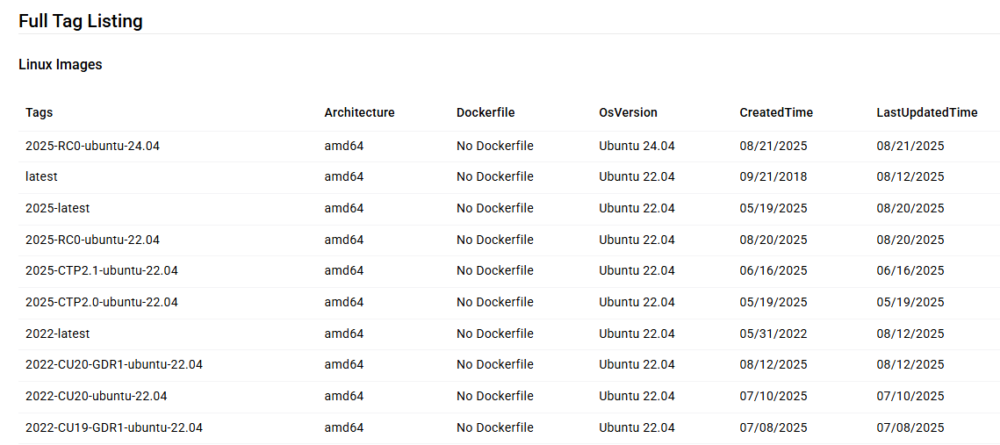
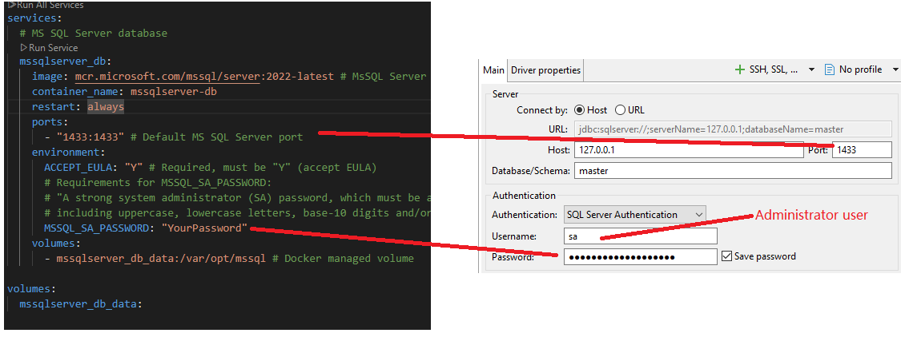

# Intro

This `docker-compose.yml` file defines a basic setup for running a local **Microsoft SQL Server** server using **Docker Compose**.

It creates one service:

- **mssqlserver_db** - Microsoft SQL Server Database.

# Configuration details

## General

- the **latest** `MS SQL Server 2022` image is pulled.
  - _Microsoft SQL Server_ official docker image [docs](https://hub.docker.com/r/microsoft/mssql-server)
- `container_name` is used instead of default name.

## `mssqlserver_db` Service

- Exposes the default MS SQL Server port `1433`.
- A mandatory environment variable `ACCEPT_EULA` must be set to `Y`, otherwise container can't be instantiated.
- A mandatory environment variable `MSSQL_SA_PASSWORD` sets the password for the database system administrator user `sa`. (For a full list of environment variables, see the official SQL Server
  [Docker image documentation](https://hub.docker.com/r/microsoft/mssql-server), under _Environment variables_)
- Uses a Docker-managed volume named `mssqlserver_db_data` (not a local host directory)

## MS SQL Server Images

In the example, the latest image of SQL Server 2022 is used, but other images are available, like:

- mcr.microsoft.com/mssql/server:2025-latest -> latest image of SQL Server 2025
- mcr.microsoft.com/mssql/server:2019-latest -> latest image of SQL Server 2019

Full list of available images and SQL Server versions is shown in
_Full Tag Listing_ secion of the [Docker image documentation](https://hub.docker.com/r/microsoft/mssql-server).

## MS SQL Server Login Details

- User name is `sa`.
- Password for the above user is set via `MSSQL_SA_PASSWORD` Environment.

# Connecting to Microsoft SQL Server

In the example below, `DBeaver` application is used.

- Host: **127.0.0.1** (localhost)
- Port: **1433** (the default MS SQL Server port, set in your Compose file)
- Username: **sa**
- Password: (value from `MSSQL_SA_PASSWORD` in your Compose file)

