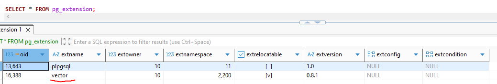
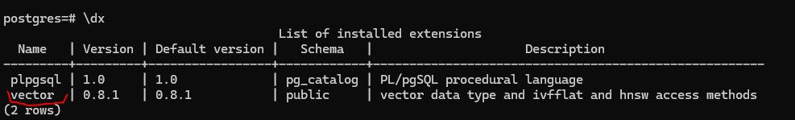

# Intro

This `docker-compose.yml` file defines a basic setup for running a local **PostgreSQL** server with the **pgvector** extension installed, using **Docker Compose**.

The main purpose is to test **pgvector** extension in the context of **Vector Database** topic.

# Services

It creates one service:

- **postgresql_db** - A PostgreSQL Database Server.

> Note:
> This below service is optional and is commented out by default:

- **pgadmin** - A web-based UI for PostgreSQL, that makes it easier to manage your database and run queries,
  compared to using the command-line `psql` tool.

# Configuration details

## General

- For services.
  - **postgresql_db**: a **custom image** is created (more about this in section **postgresql_db custom image**)
  - **pgadmin**: the **latest official** image (_pgAdmin4_ official docker image [docs](https://hub.docker.com/r/dpage/pgadmin4/)) is pulled
- For both services, `container_name` is used instead of default names.

## `postgresql_db` Service

- Exposes the default PostgreSQL port `5432`.
- Defines one required environment variable:
  - `POSTGRES_PASSWORD` - sets the password for the default PostgreSQL user. (For a full list of environment variables, see the official PostgreSQL
    [Docker image documentation](https://hub.docker.com/_/postgres), under _How to extend this image_)
- Uses a Docker-managed volume named `postgresql_db_data` (not a local host directory)

## (optional) `pgadmin` Service

- Exposes port `8888` to access the pgAdmin Web UI.
- Defines two required environment variables:
  - `PGADMIN_DEFAULT_EMAIL` - the email address used to log in to pgAdmin.
  - `PGADMIN_DEFAULT_PASSWORD` - the password used with the above email.
  - Uses a Docker-managed volume named `pgadmin_data`.

## PostgreSQL Login Details

- Since `POSTGRES_USER` is not set, the default PostgreSQL username is: **postgres**.
- Since `POSTGRES_DB` is also not set, the default database name will match the username: **postgres**.

# postgresql_db custom image

For `postgresql_db` service, a custom image is created and built.
The main purpose of this image is to download and install a `pgvector` PostgreSQL extension.
Definition of the custom image can be found in `Dockerfile` file.

Main steps are:

- get appropriate dependencies that are essential to build `pgvector` extension:
  - build-essential
  - git
  - postgresql-server-dev-18
- clone the newest version of `pgvector` extension
- build `pgvector` extension
- cleanup from dependencies that are no longer used after the build (this step decreases the final image size)

# Enabling pgvector, running code

## Enabling pgvector

`pgvector` extension must be enabled by running the below code on PostgreSQL server:

```sql
CREATE EXTENSION IF NOT EXISTS vector;
```

To check, if the extension is enabled, the below queries can be used:

- `SELECT * FROM pg_extension;` - shows all **enabled** extensions
- `SELECT * FROM pg_available_extensions;` - shows all **available** extensions on the server (`installed_version` column indicates which version of the exension is installed, if NULL then a given extension is not installed). **available** != **enabled**
- `SELECT * FROM pg_available_extension_versions;` - more detailed version of the query above that includes also all available versions of a given extension, plus some more advanced details.

Result of `SELECT * FROM pg_extension;` command:


In `psql`, a command `\dx` can be also used:


# Sample code

After `pgvector` extension has been enabled, a new column type `vector` can be used and some manipulations can be done.

## Create a table with `vector` column type

```sql
CREATE TABLE items (
  id SERIAL PRIMARY KEY,
  embedding vector(3) -- This is a column with a new column type vector, size of the vector is set to 3
);
```

## Insert some data into the table

```sql
INSERT INTO items (embedding) VALUES ('[1,2,3]'), ('[4,5,6]'), ('[1,1,1]');
```

## Run some SQL queries:

1. Order vectors by closest similarity to the given vector [2,3,4] using [Euclidean Distance](https://en.wikipedia.org/wiki/Euclidean_distance) between vectors

```sql
SELECT *, embedding <-> '[2,3,4]' as euclidean_distance
FROM items ORDER BY embedding <-> '[2,3,4]';
```

2. Order vectors by closest similarity to the given vector [2,3,4] using [Cosine Distance](https://en.wikipedia.org/wiki/Cosine_similarity) between vectors

```sql
SELECT *, embedding <=> '[2,3,4]' as cosine_distance
FROM items ORDER BY embedding <=> '[2,3,4]';
```

# pgAdmin4

`docker-compose.yml` file consists also of **PgAdmin4** Web UI for PostgreSQL.
If you want to use it, uncomment appropriate section in the file.
Detailed comments can be found in the file.
