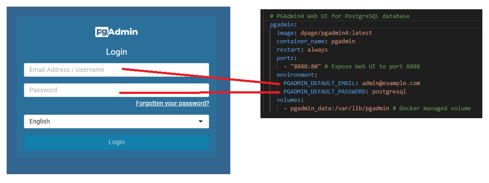
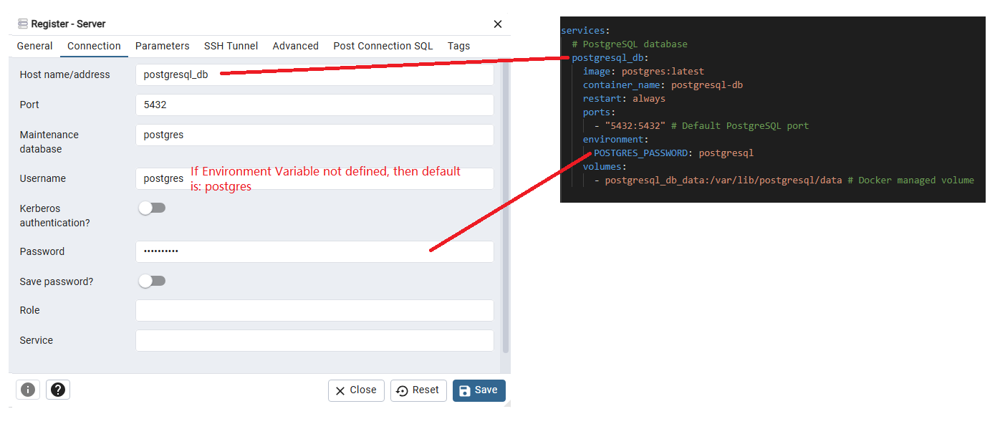

# Intro

This `docker-compose.yml` file defines a basic setup for running a local **PostgreSQL** server using **Docker Compose**.

It creates two services:

- **postgresql_db** - A PostgreSQL Database Server.
- **pgadmin** - A web-based UI for PostgreSQL, that makes it easier to manage your database and run queries, compared to using the command-line `psql` tool.

# Configuration details

## General

- for both services, the **latest** images are pulled.
  - _PostgreSQL_ official docker image [docs](https://hub.docker.com/_/postgres)
  - _pgAdmin4_ official docker image [docs](https://hub.docker.com/r/dpage/pgadmin4/)
- for both services, `container_name` is used instead of default names.

## `postgresql_db` Service

- Exposes the default PostgreSQL port `5432`.
- Defines one required environment variable:
  - `POSTGRES_PASSWORD` - sets the password for the default PostgreSQL user. (For a full list of environment variables, see the official PostgreSQL
    [Docker image documentation](https://hub.docker.com/_/postgres), under _How to extend this image_)
- Uses a Docker-managed volume named `postgresql_db_data` (not a local host directory)

## `pgadmin` Service

- Exposes port `8888` to access the pgAdmin Web UI.
- Defines two required environment variables:
  - `PGADMIN_DEFAULT_EMAIL` - the email address used to log in to pgAdmin.
  - `PGADMIN_DEFAULT_PASSWORD` - the password used with the above email.
  - Uses a Docker-managed volume named `pgadmin_data`.

## PostgreSQL Login Details

- Since `POSTGRES_USER` is not set, the default PostgreSQL username is: **postgres**.
- Since `POSTGRES_DB` is also not set, the default database name will match the username: **postgres**.

# pgAdmin Login & Connecting to PostgreSQL

## Logging into the pgAdmin Web UI

Use the credentials set in the `docker-compose.yml` file (`PGADMIN_DEFAULT_EMAIL` and `PGADMIN_DEFAULT_PASSWORD`) to log in:

## Connecting to the PostgreSQL Server via pgAdmin

After logging in, register a new server in pgAdmin using the following details:

- Host: **postgresql_db** (the name of the service defined in Docker Compose)
- Port: **5432** (the default PostgreSQL, set in your Compose file)
- Username: **postgres**
- Password: (value from `POSTGRES_PASSWORD` in your Compose file)

